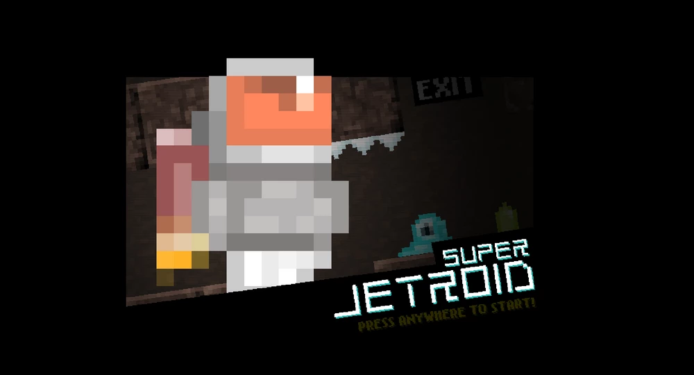

# Super Jetroid

Super Jetroid is one of the 2D games I created while learning Unity. 

# What I did

- Optimizing sprites and draw cells
- Cutting up sprite sheets
- Building & Changing animations
- Creating & Moving the player
- Building a level with a simple map
- Creating interactive objects
- Creating alien enemies
- Switching between scenes
